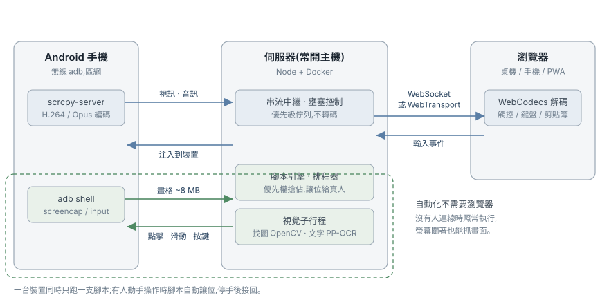

# speedcrcpy

自架的 Web 版 scrcpy。從任何瀏覽器遠端操控 Android 裝置,**並且讓它自己動起來**。

兩件事,可以分開用:

- **遠端操控** — 畫面鏡像、觸控、鍵盤、音訊、剪貼簿。針對弱網做了大量優化,寧可局部殘影漸進癒合,也不凍結卡頓。
- **視覺自動化** — 在瀏覽器裡編輯腳本,伺服器端用 adb 執行。找圖、找字、判斷情境、條件分支、模組、定時排程。**不需要任何人開著瀏覽器**,螢幕關著也能跑。



<!-- 截圖:裝置清單頁(多台裝置 + 縮圖 + 電量溫度)→ docs/images/devices.png -->
<!-- 截圖:鏡像畫面(含上方工具列)→ docs/images/mirror.png -->

---

## 遠端操控

| | |
|---|---|
| **畫面** | H.264 / H.265,瀏覽器 WebCodecs 硬體解碼,伺服器不轉碼 |
| **控制** | 觸控、滑鼠、實體鍵、導覽鍵,中文 IME 直接打字 |
| **音訊** | Opus 轉發(Android 11+) |
| **剪貼簿** | 雙向同步 |
| **畫質** | 1440p → 360p 階梯,手動指定或自動調適 |
| **省電** | 關閉被控端實體螢幕,鏡像與觸控照常(專用機降溫用) |
| **多人** | 一人控制、其他人觀看;控制權要明確取得,不會自動易主 |
| **PWA** | 可加到手機主畫面當 App 用,鏡像時螢幕保持喚醒 |

### 弱網優化

這是這個專案跟「把 scrcpy 包成網頁」最大的差別:

- **穿透模式** — 網路變差時丟掉過時畫格但持續餵解碼器,畫面出現短暫殘影並在 1–2 秒內自動癒合(intra-refresh),全程不凍結
- **閘控模式** — 若瀏覽器解碼器不容忍缺參考幀,自動改為暫停 → 排空 → 從新 keyframe 續播
- **分塊優先級傳輸** — 輸入事件永遠不會被視訊塞住
- **雙信號壅塞偵測** — `bufferedAmount` 加上客戶端延遲梯度,兩個都看
- **自動升降檔** — 持續壅塞降到最低 360p/300 kbps,恢復後 20 秒逐步升回
- **WebTransport(選用)** — 走 QUIC,避開 TCP 隊頭阻塞;預設關閉,WebSocket 永遠是後備

<!-- 截圖:📊 即時統計面板(位元率/RTT/延遲梯度/丟幀/模式)→ docs/images/stats.png -->

---

## 視覺自動化

腳本在伺服器端執行,全程走 adb —— **裝置上沒有任何 viewer session 也能跑**,真正擺著跑。座標一律正規化,換解析度或旋轉都不會壞。

<!-- 截圖:腳本編輯器(展開幾個步驟,看得到圖像縮圖與相似度)→ docs/images/script-editor.png -->

### 步驟

| 類別 | 步驟 |
|---|---|
| **動作** | 點擊、滑動、輸入文字、按鍵、等待 |
| **找圖** | 找圖點擊、若找到圖、**辨識情境** |
| **找字** | 依文字點擊、若文字含、讀取數值(OCR) |
| **顏色** | 等待顏色、若顏色 |
| **流程** | 重複、若變數、跳到標記、停止、呼叫模組 |
| **App** | 啟動 / 關閉 / 重啟指定 App,可等它回到前景 |

**辨識情境**值得單獨講:一次截圖比對**多張**圖,回答「現在是哪個畫面」,把命中的名稱存進變數給後面分支用。用一連串找圖問同一個問題,每張都要付一次 ~350 ms 的截圖,而且最後一張看到的已經是另一個時刻的畫面了。

<!-- 截圖:辨識情境步驟展開 + 測試結果(每列分數/門檻/命中截圖)→ docs/images/identify.png -->

### 讓腳本管得動

- **變數** — 有型別(數字/文字/真假/圖像/範圍),`若變數` 依型別提供合適的比較
- **模組** — 把一段腳本抽成模組,用「呼叫模組」當一個步驟用,有進出參數,可以就地編輯
- **標記與跳躍** — 每個步驟可以取名字,`跳到標記` 瞄準名字而不是行號,搬動步驟不會壞
- **開關** — 每個步驟可以停用而不刪除,調好的圖像與門檻不會因為想試一下就丟掉
- **草稿** — 沒存的編輯關掉面板也還在
- **單步執行** — 只跑游標所在那一段,用畫面上的內容,不必先儲存

### 排程

- **手動** / **常駐**(有空就跑) / **每日**(固定時間觸發一次)
- **優先權搶佔** — 每日活動腳本可以打斷常駐掛機腳本,結束後掛機自動接回
- **真人優先** — 你一動手,腳本立刻讓位;停手後自己接回

### 看它做了什麼

- **執行紀錄** — 每一步做了什麼、比對到幾 %、命中在哪裡
- **回放** — 持續側錄每台裝置的畫面縮時,腳本事件標在時間軸上。事後回去看「三點鐘那次卡住時螢幕上是什麼」
- **截圖** — 隨時擷取全解析度畫面,複製到剪貼簿或下載

<!-- 截圖:回放面板(時間軸 + 某一格畫面 + 該時刻的腳本紀錄)→ docs/images/replay.png -->

---

## 快速開始(Docker)

映像已內建 `adb`,主機不必另裝。無線 adb 走 outbound 連線,預設 bridge 網路就能連到區網手機。

```bash
docker run -d --name speedcrcpy \
  --restart unless-stopped \
  -p 8000:8000 \
  -e SPEEDCRCPY_PASSWORD=改成你的密碼 \
  -v speedcrcpy-data:/data \
  -v speedcrcpy-adb:/root/.android \
  ghcr.io/otaku840726/speedcrcpy:latest
```

- `/data` 保存密碼、HMAC 金鑰、裝置清單、腳本、回放
- `/root/.android` 保存 adb 金鑰,裝置授權跨重啟保留
- **容器預設關閉被控端實體螢幕**(專用被控裝置降溫);要保持螢幕亮著加 `-e SPEEDCRCPY_SCREEN_OFF=false`
- 極少數 Android 9 以下的無線情境需要手機回連容器,那時改用 `--network host`

## 從原始碼執行

需要 Node.js 22+、pnpm、Google `adb`(platform-tools)。

```bash
pnpm install        # 會自動下載 scrcpy-server 官方 jar 與 PP-OCR 模型
pnpm build
node packages/server/dist/index.js
```

開發模式(前後端熱重載):

```bash
pnpm dev            # server :8000 + Vite :5173(已設 proxy)
```

首次啟動會自動產生登入密碼並寫入 `data/config.json`,log 也會印出來。

## 設定

環境變數,或 `data/config.json`:

| 變數 | 預設 | 說明 |
|---|---|---|
| `SPEEDCRCPY_PORT` | `8000` | 監聽埠 |
| `SPEEDCRCPY_HOST` | `0.0.0.0` | 監聽位址 |
| `SPEEDCRCPY_PASSWORD` | 自動產生 | 登入密碼 |
| `SPEEDCRCPY_DATA_DIR` | `./data` | 資料目錄 |
| `SPEEDCRCPY_ADB_HOST` / `SPEEDCRCPY_ADB_PORT` | `127.0.0.1:5037` | adb server 位置 |
| `SPEEDCRCPY_SCREEN_OFF` | `false`(Docker 映像 `true`) | 每次鏡像預設關閉被控端實體螢幕 |
| `SPEEDCRCPY_VIDEO_CODEC` | `h264` | 預設編碼(`h264` / `h265`) |
| `SPEEDCRCPY_REPLAY` | `true` | 是否側錄回放 |
| `SPEEDCRCPY_REPLAY_MAX_MB` | `500` | 回放總容量上限 |
| `SPEEDCRCPY_WT_ENABLED` | `false` | 啟用 WebTransport(需開 UDP 埠) |

## HTTPS(遠端訪問必須)

WebCodecs 與剪貼簿 API 需要 secure context,所以遠端訪問一定要走 HTTPS。LAN 內用 `http://<主機IP>:8000` 可以(localhost 例外允許)。

**Tailscale(最簡單):**

```bash
tailscale serve --bg 8000
```

之後用 `https://<主機名>.<tailnet>.ts.net` 訪問。

**Caddy(公網 IP + 網域):**

```
your.domain.com {
    reverse_proxy localhost:8000
}
```

## 連接手機

1. 手機開啟 開發人員選項 → 無線偵錯(Android 11+);舊機型先用 USB 執行 `adb tcpip 5555` 後拔線
2. 第一次要配對:裝置頁 → 配對 → 輸入配對位址與配對碼(手機「使用配對碼配對裝置」畫面上顯示)
3. 輸入連線位址(port 通常是 5555,或無線偵錯顯示的動態 port)→ 連線
4. 點「鏡像」開始

已連過的裝置會記住並自動重連(可關)。注意 `adb tcpip 5555` 模式重開機後會失效,要重新用 USB 開啟;無線偵錯的動態 port 重開機後也會變。

## 安全

- 所有 API 與 WebSocket 都需要登入(HMAC token,30 天效期)
- 登入錯誤限流(每 IP 每分鐘 5 次)
- 建議只在 Tailscale/VPN 內暴露;若用公網 IP 務必配 HTTPS 且用強密碼

## 授權

[PolyForm Noncommercial License 1.0.0](LICENSE) — 個人、教育、研究與非營利組織可自由使用、修改、散布,**不得用於商業用途**。

這不是 OSI 定義的「開源」:開源定義不允許限制使用領域,所以任何禁止商用的授權都屬於「原始碼公開」。

本專案在執行與打包時會取用第三方元件,它們各自的授權不受本授權影響:

- [scrcpy](https://github.com/Genymobile/scrcpy) 的 `scrcpy-server.jar`(Apache-2.0)— 建置時下載,包含在 Docker image 內
- [PP-OCRv6](https://github.com/PaddlePaddle/PaddleOCR) 模型權重(Apache-2.0)— 同上
